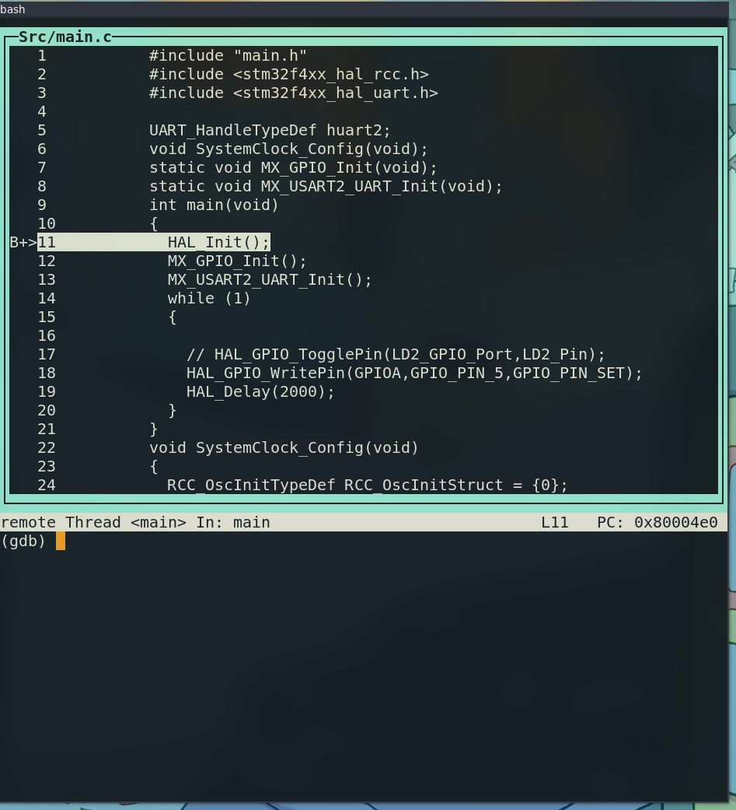

## Setting up GDB 
- you need to install 
```bash 
sudo apt install st-util 
```
the st-util will be the GDB server that will communicates with the stlink inside the stm32 

> make sure before you run the st-util to have pluged in the stm32 with ur PC 

- Now you are supposed to configrue the arm-gcc tool chain, so via this [link](https://developer.arm.com/downloads/-/gnu-rm) install the arm toolchain 
- extract 
- cp the folder in the /opt 
- export the  `gcc-arm-none-eabi-10.3-2021.10/bin` to have full access to the binaries. 


- using gdb, make sure to compile the code with debug target to add the debug symbols. 

```bash
make debug   
```
- while the st-util is running it provided u with a port in my case its `4242` 
- now run `arm-none-eabi-gdb Template_proj.elf` 
- we need to first to connect to the server 
```gdb 
target remote :4242 #(port)
```
- we need to load the program 
```
load 
```
the program is loaded into memory , if we run bt (backtrace)
```gdb
bt
```
we will see that we at the reset handler 
```gdb 
st
```
setp into the function, this is the function that will load the main func, so we insert a break point at main  
```gdb 
b main 
```
if we move to tui env ( CTRL x + a), we get 


we see that we are at HAL_Init() func 
then we can manipulate and go through the code 

`s` : step into a function 
`bt` for backtrace we see all the above fucntion 
`c` for continue 


`monitor reset halt`: restat from the begining 

to exit run this command 
`quit`


## Seting up GDB with VScode 
"configFiles": []
This is used when debugging with OpenOCD instead of ST-Link GDB Server.
It specifies OpenOCD configuration files (.cfg) needed to set up debugging.
Since you're using ST-Link GDB Server, this is not needed, so it's left as an empty array ([]).

"svdFile": "${workspaceFolder}/STM32F401.svd"
SVD (System View Description) files describe the registers and peripherals of the MCU.
This file allows VS Code’s Cortex-Debug extension to display register-level debugging information, making it easier to inspect and modify hardware registers during debugging.
If you don't have the .svd file, you can remove this line, but you'll lose some debugging features like register visibility.


## Open OCD 
```bash 
sudo apt install openocd
```